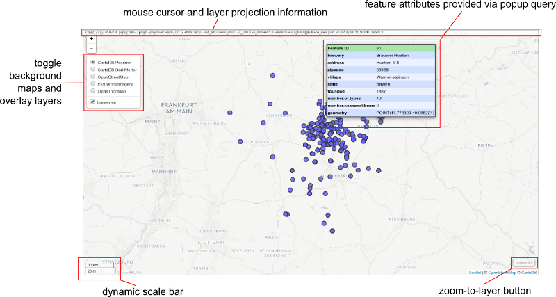

# mapview

<!-- badges: start -->
[](https://github.com/r-spatial/mapview/actions)
[](https://cran.r-project.org/web/checks/check_results_mapview.html)


[](https://cran.r-project.org/package=mapview)
[](https://www.gnu.org/licenses/gpl-3.0.html)
[](https://app.codecov.io/github/r-spatial/mapview)
[](https://CRAN.R-project.org/package=mapview)
<!-- badges: end -->

### Interactive viewing of spatial data in R

<a href="https://github.com/tim-salabim/mvl"></a>

**mapview** provides functions to very quickly and conveniently create
interactive visualisations of spatial data. It’s main goal is to fill
the gap of quick (not presentation grade) interactive plotting to
examine and visually investigate both aspects of spatial data, the
geometries and their attributes. It can also be considered a data-driven
API for the [**leaflet**](https://cran.r-project.org/package=leaflet)
package as it will automatically render correct map types, depending on
the type of the data (points, lines, polygons, raster). In addition, it
makes use of some advanced rendering functionality that will enable
viewing of much larger data than is possible with **leaflet**.
Furthermore, if you’re a fan of
[**mapdeck**](https://cran.r-project.org/package=mapdeck) (which you
should!), you can choose to use it as the rendering platform instead of
**leaflet** by setting `mapviewOptions(platform = "mapdeck")`.

The main user relevant functions are:

- `mapview` - view (multiple) spatial objects on a set of background
  maps
- `viewExtent` - view extent / bounding box of spatial objects
- `viewRGB` - view RGB true- or false-color images of raster objects
- `mapshot` - easily save maps (including leaflet maps) as `html` and/or
  `png` (or other image formats)

Functions that have been deprecated/deleted recently:

- `addHomeButton` - deprecated, use package
  [leafem](https://CRAN.R-project.org/package=leafem) instead.
- `addLogo` - deprecated, use package
  [leafem](https://CRAN.R-project.org/package=leafem) instead.
- `addFeatures` - deprecated, use package
  [leafem](https://CRAN.R-project.org/package=leafem) instead.
- `addMouseCoordinates` - deprecated, use package
  [leafem](https://CRAN.R-project.org/package=leafem) instead.
- `addExtent` - deprecated, use package
  [leafem](https://CRAN.R-project.org/package=leafem) instead.
- `addImageQuery` - deprecated, use package
  [leafem](https://CRAN.R-project.org/package=leafem) instead.
- `latticeView` & `sync` - deprecated, use package
  [leafsync](https://CRAN.R-project.org/package=leafsync) instead.
- `slideView` - deprecated, use package
  [slideview](https://CRAN.R-project.org/package=slideview) instead.
- `cubeView` - deprecated, use package
  [cubeview](https://CRAN.R-project.org/package=cubeview) instead.
- `plainview` - deprecated, use package
  [plainview](https://CRAN.R-project.org/package=plainview) instead.
- `popupTable`, `popupGraph` & `popupImage` - deprecated, use package
  [leafpop](https://CRAN.R-project.org/package=leafpop) instead.
- `addLargeFeatures` - use
  [leafgl](https://CRAN.R-project.org/package=leafgl)`::addGL*`
  functions instead.

Objects of the following spatial classes are supported:

- [sf](https://cran.r-project.org/package=sf)
- [raster](https://cran.r-project.org/package=raster) (Layer, Stack,
  Brick and SpatialPixels\* / SpatialGridDataFrame)
- [stars](https://cran.r-project.org/package=stars)
- [sp](https://cran.r-project.org/package=sp) (Points, Polygons, Lines
  and their DataFrame version)
- [satellite](https://cran.r-project.org/package=satellite)

## Installation

For CRAN release version of **mapview** use

``` r
install.packages("mapview")
```

To install the development version you can install the
[remotes](https://cran.r-project.org/package=remotes) package.

**NOTE:** As of version 2.9.1 development will happen on the `master`
branch. Please consider the `develop` branch obsolete.

``` r
remotes::install_github("r-spatial/mapview")
```

## Usage

The most basic call

``` r
mapview(breweries)
```

will produce a web map visualisation of the breweries data with the
following components:



## Contact

Please file bug reports and feature requests at
<https://github.com/r-spatial/mapview/issues>
